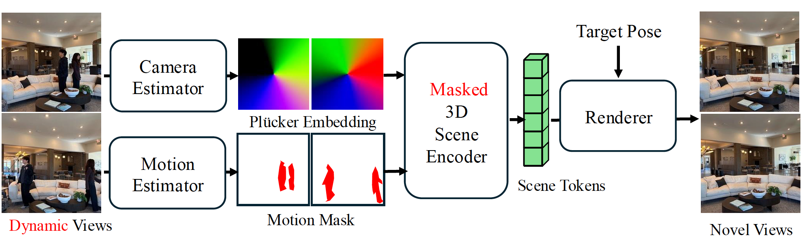
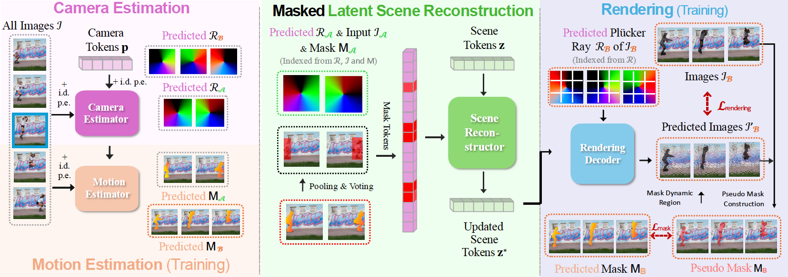

<div align="center">

# WildRayZer: Self-supervised Large View Synthesis in Dynamic Environments

<p align="center">
    <a href="https://xuweiyichen.github.io/">Xuweiyi Chen</a>,
    <a href="https://smirkkkk.github.io/">Wentao Zhou</a>,
    <a href="https://sites.google.com/site/zezhoucheng/">Zezhou Cheng</a>
</p>

<p align="center">
    <strong>University of Virginia</strong>
</p>

</div>

<div align="center">
    <a href="https://arxiv.org/abs/2601.10716"><strong>Paper</strong></a> |
    <a href="https://wild-rayzer.cs.virginia.edu/"><strong>Project Page</strong></a> |
    <a href="https://huggingface.co/datasets/uva-cv-lab/Dynamic-RE10K"><strong>Dynamic-RE10K</strong></a> |
    <a href=""><strong>🤗 Live Demo (coming soon)</strong></a>
</div>

--------------------------------------------------------------------------------

## News

- **2026-04** — WildRayZer was accepted to **CVPR 2026 as a Highlight**! 🎉

---

## Overview

**WildRayZer** is a self-supervised framework for novel view synthesis (NVS) in dynamic environments, where both the camera and objects move. It extends the state-of-the-art self-supervised large view synthesis model [RayZer](https://hwjiang1510.github.io/RayZer/) to dynamic environments by adding a **learned motion mask estimator** and a **masked 3D scene encoder** — all without any 3D or ground-truth mask supervision.

<p align="center">
  
</p>

---

## 1. Preparation

### Environment

```bash
conda create -n wildrayzer python=3.11
conda activate wildrayzer
pip install -r requirements.txt
```

As we use [xformers](https://github.com/facebookresearch/xformers) `memory_efficient_attention`, the GPU device compute capability needs > 8.0. Otherwise, it will raise an error. Check your GPU compute capability at [CUDA GPUs Page](https://developer.nvidia.com/cuda-gpus#compute).

### Data

The code expects the following layout under `./data/`:

```
data/
├── re10k_processed_v2/            # Static RealEstate10K (preprocessed)
│   └── train/full_list.txt
├── dynamic_re10k/                 # Dynamic RealEstate10K (ours)
│   ├── train/full_list.txt
│   └── test/
│       ├── dre10k_final_context_2.txt
│       ├── dre10k_final_context_2_view_idx.json
│       ├── wildrayzer_final_context_2.txt
│       ├── wildrayzer_final_context_2_view_idx.json
│       └── binary_masks/            # Optional GT motion masks for eval
└── coco/                           # For copy-paste augmentation (Stage 3)
    ├── train2014/
    └── annotations/instances_train2014.json
```

#### RealEstate10K (static)

We use the preprocessed RealEstate10K from the [LVSM release pipeline](https://github.com/Haian-Jin/LVSM). Follow those instructions to obtain `re10k_processed_v2/` with per-scene metadata and `full_list.txt`. The dataset cannot be redistributed due to the original license — download the raw clip list from the [RealEstate10K project page](https://google.github.io/realestate10k/) and re-run the preprocessing pipeline.

#### Dynamic-RE10K (D-RE10K)

Download from Hugging Face: **https://huggingface.co/datasets/uva-cv-lab/Dynamic-RE10K**

| Split | Description | Sequences | Status |
|-------|-------------|-----------|--------|
| D-RE10K Train | Dynamic indoor scenes for training | ~15K | Available |
| D-RE10K Motion Mask | Human-verified motion masks for eval | 74 | Available |
| D-RE10K-iPhone | Paired transient/clean sequences | 50 | *Coming soon* |

```bash
# Example (requires `huggingface_hub`):
huggingface-cli download uva-cv-lab/Dynamic-RE10K --repo-type dataset --local-dir ./data/dynamic_re10k
```

The D-RE10K-iPhone benchmark (§5 of the paper; paired transient/clean iPhone captures for sparse-view evaluation) will be released separately — check back on the Hugging Face page.

#### COCO (for copy-paste)

Download COCO 2014 train images and instance annotations:

```bash
# From https://cocodataset.org/#download
wget http://images.cocodataset.org/zips/train2014.zip
wget http://images.cocodataset.org/annotations/annotations_trainval2014.zip
```

### Checkpoints

We release the **2-input-view** checkpoint used by the demo. Place it at `./checkpoints/wildrayzer_2view.pt`; `configs/wildrayzer_inference.yaml` and the Gradio demo point there by default.

| Views | Model | Download |
|-------|-------|----------|
| 2-input / 6-target | WildRayZer | *Upload link coming soon* |

To train your own checkpoint (e.g. 3- or 4-input-view settings), follow the three-stage pipeline in [§3 Training](#3-training). A full run from Stage 1 → Stage 3 on 8× H100 reproduces the paper's D-RE10K numbers.

---

## 2. Method

<p align="center">
  
</p>

**(a) Training.** A camera-only static renderer explains the rigid background; residuals between renderings and targets highlight dynamic regions, which are sharpened with a pseudo-motion masks constructor. The motion estimator is distilled from these pseudo-masks and used to gate dynamic image tokens before scene encoding; the same pseudo-masks also gate dynamic pixels in the rendering loss.

**(b) Inference.** Given a set of dynamic input images, the model predicts camera parameters and motion masks in a single feed-forward pass. The motion estimator operates only on input views, masks out dynamic tokens, and the renderer synthesizes transient-free novel views from the inferred static scene.

### Key Components

1. **Self-supervised pseudo-label generation** — DINOv3 + SSIM + co-segmentation + GrabCut
2. **Three-modality motion predictor** — semantic (DINOv3), appearance (image tokens), geometric (Plücker)
3. **MAE-style token masking** — replaces dynamic tokens with learnable noise before scene encoding
4. **Copy-paste augmentation** — injects COCO objects as synthetic transients for Stage 3

---

## 3. Training

Before training, generate a Wandb API key following [these instructions](https://docs.wandb.ai/guides/track/public-api-guide/) and save it in `configs/api_keys.yaml` (use `configs/api_keys_example.yaml` as template).

The training pipeline follows the paper's four stages, collapsed into three configs (Stage 3 and Stage 4 — masked reconstruction and joint copy-paste — are combined in the final config).

### Stage 1 — RayZer Pretraining

Pretrain the static RayZer backbone on RealEstate10K.

```bash
torchrun --nproc_per_node 8 --nnodes 1 \
    --rdzv_id 18635 --rdzv_backend c10d --rdzv_endpoint localhost:29502 \
    train.py --config configs/wildrayzer_stage1_pretrain.yaml
```

### Stage 2 — Motion Mask Training

Freeze the pretrained renderer and train only the motion mask predictor against DINOv3+SSIM pseudo-labels.

```bash
torchrun --nproc_per_node 8 --nnodes 1 \
    --rdzv_id 18635 --rdzv_backend c10d --rdzv_endpoint localhost:29502 \
    train.py --config configs/wildrayzer_stage2_motion_mask.yaml
```

### Stage 3 — Joint Masked Reconstruction + Copy-Paste

Unfreeze the renderer and jointly train both components with copy-paste augmentation on COCO objects.

```bash
torchrun --nproc_per_node 8 --nnodes 1 \
    --rdzv_id 18635 --rdzv_backend c10d --rdzv_endpoint localhost:29502 \
    train.py --config configs/wildrayzer_stage3_joint_copy_paste.yaml
```

### Key Config Options

```yaml
model:
  use_motion_mask: true              # Enable motion mask prediction
  use_dinov3_pseudolabel: true       # Enable DINOv3 pseudo-labels
  use_mae_masking: true              # Enable MAE-style token masking

training:
  mask_distill_loss_weight: 1.0      # Mask prediction distillation
  psnr_filter_threshold: 17.0        # Skip BCE loss when pseudo-label is unreliable
  copy_paste:
    enabled: true                    # Stage 3 only
```

---

## 4. Inference

```bash
torchrun --nproc_per_node 8 --nnodes 1 \
    --rdzv_id 18635 --rdzv_backend c10d --rdzv_endpoint localhost:29506 \
    inference.py --config configs/wildrayzer_inference.yaml \
    inference.model_path=./checkpoints/wildrayzer_2view.pt \
    inference_out_root=./experiments/evaluation/test
```

Point `inference.model_path` at the checkpoint produced by Stage 3 training (e.g. `./experiments/wildrayzer_stage3_joint_copy_paste/checkpoints/ckpt_LATEST.pt`) or the demo copy at `./checkpoints/wildrayzer_2view.pt`.

After inference, the code generates an HTML file in the output directory for viewing results.

### Plücker Diagnostics

Set `inference.save_plucker_vis=true` to export per-target visualizations (direction RGB, ‖m‖ heatmap, Klein residual, optional quiver plot). Optional settings: `inference.plucker_vis_stride` (default `16`) and `inference.plucker_vis_include_quiver` (default `false`).

---

## 5. Known Issues

The model can be sensitive to the number of views due to image index positional embedding. Ensure the number of views is the same at training and testing time. The released 2-input-view checkpoint is trained and intended for 2-input + 6-target views.

---

## Citation

If you find this work useful, please cite:

```bibtex
@inproceedings{chen2026wildrayzer,
  title     = {WildRayZer: Self-supervised Large View Synthesis in Dynamic Environments},
  author    = {Chen, Xuweiyi and Zhou, Wentao and Cheng, Zezhou},
  booktitle = {Proceedings of the IEEE/CVF Conference on Computer Vision and Pattern Recognition (CVPR)},
  note      = {Highlight},
  year      = {2026},
}
```

---

## Acknowledgements

The authors acknowledge the MathWorks Research Gift, Adobe Research Gift, the University of Virginia Research Computing and Data Analytics Center, Advanced Micro Devices AI and HPC Cluster Program, Advanced Cyberinfrastructure Coordination Ecosystem: Services & Support (ACCESS) program, and National Artificial Intelligence Research Resource (NAIRR) Pilot for computational resources, including the Anvil supercomputer (National Science Foundation award OAC 2005632) at Purdue University and the Delta and DeltaAI advanced computing resources (National Science Foundation award OAC 2005572).

---

## Related Work

This codebase is developed based on [RayZer](https://hwjiang1510.github.io/RayZer/) and [LVSM](https://github.com/Haian-Jin/LVSM).
